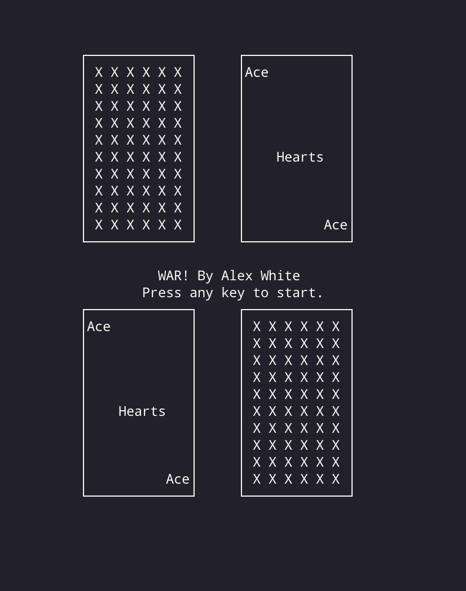
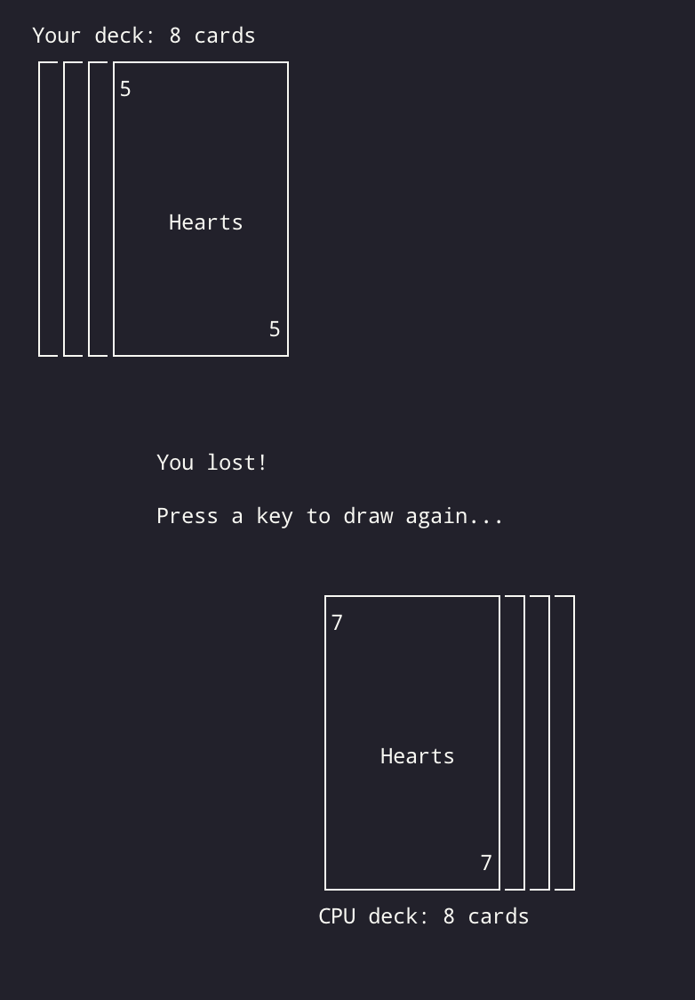

# War: TTY Edition

A version of the War card game for terminal emulators. Features advanced terminal graphics thanks to ncurses!

## How to play

Run the program through your terminal `./war`. 

On Linux, you may have to give executable permissions with `sudo chmod +x ./war`. Then mash your keyboard a bunch until the game finishes!

## Building

Game has been built on Linux and Mac OS. No idea how C++ compilation works (or if it even does without WSL) on Windows.

You will need lib-ncurses installed to build. After that, simply `cd` to the directory and build with `g++ -lncurses -std=c++11  main.cpp`.